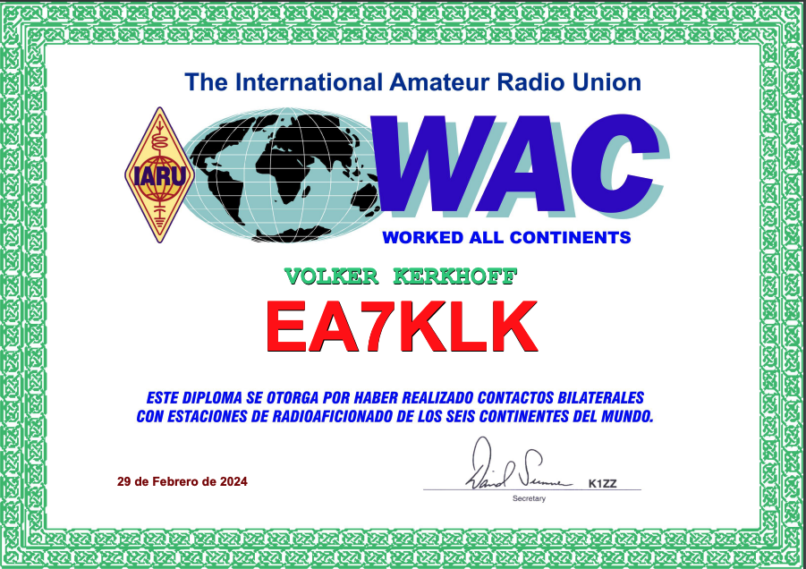
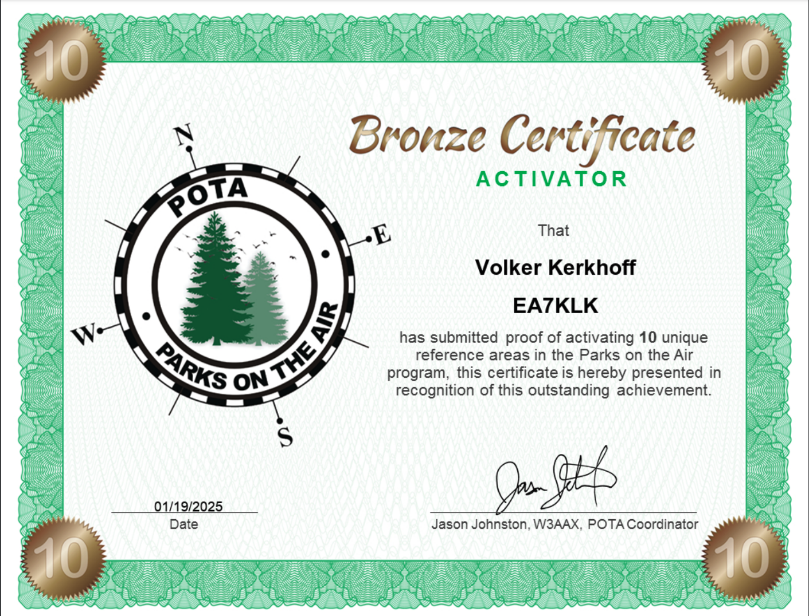

La radio me ha fascinado desde que mi padre, ávido radioescucha DXista se pasaba largas noches de invierno escuchando los programas en alemán y español de países lejanos y servicios marítimo/terrestres con un receptor de onda corta PANASONIC en mi infancia. Sin lugar a dudas, esto sembró en mi la semilla del interés por las radiocomunicaciones.

Desde que me adentré en el mundo de la radioafición, he tenido la suerte de vivir una trayectoria apasionante y enriquecedora. En 2004, obtuve mi primer indicativo, EB3EXX, en la región de Cataluña, lo que marcó el inicio de mi viaje en este fascinante hobby. Desde entonces, he estado involucrado en diversas actividades relacionadas con la radioafición, disfrutando de la oportunidad de establecer contactos y aprender de otros apasionados del tema.

Después de unos años sin actividad en la radioafición, en 2020 y con motivo de mi traslado a Cártama, cerca de Málaga, me volví a examinar, ya bajo el nuevo reglamento con una única clase de licencia en España, obteniendo un nuevo indicativo, [EA7KLK](https://www.qrz.com/db/EA7KLK?ref=ea7klk.es) y aparte de practicar la afición y con el motivo de mi traslado en 2023 a Montequinto cerca de Sevilla soy socio de la sección local de [URE](https://www.ure.es/?ref=ea7klk.es) de Dos Hermanas y de la asociación [A.U.R - Andalucía unida por la Radio](https://ea7rcu.wordpress.com/?ref=ea7klk.es).

Uno de los proyectos de los que estoy más orgulloso es el desarrollo de una [aplicación web interactiva](https://potamap.ea7klk.es/?ref=ea7klk.es) para el programa [Parks on the Air (POTA)](https://pota.app). Esta herramienta, basada en los datos de OpenStreetMap, ayuda a los radioaficionados a localizar y explorar parques para sus operaciones de radio. Fue emocionante diseñar algo que no solo cubriera una necesidad específica, sino que también promoviera la colaboración dentro de nuestra comunidad. [El código fuente está disponible en GitHub](https://github.com/ea7klk/OSM-POTA-Map?ref=ea7klk.es) para que cualquiera pueda contribuir o adaptarlo según sus necesidades. Los radioaficionados "al aire libre" alemanes del grupo informal [draussenfunker.de](https://ddraussenfunker.de) han contribuído mucho manteniendo datos de parques del programa POTA en OpenStreetMap y los parques de Alemania están casi al completo. Yo a medida que mi tiempo me lo permite mantengo los parques de España, y he empezado por los de Andalucía, pero la falta de tiempo hace que este proceso sea lento.

Otro aspecto en el que he trabajado con entusiasmo es la configuración y personalización de equipos de radio, especialmente en el ámbito de DMR (Digital Mobile Radio). He creado y compartido codeplugs personalizados para dispositivos OpenGD77, adaptados a las necesidades específicas de los radioaficionados en España. Es gratificante saber que este trabajo ha facilitado a muchos la programación y optimización de sus equipos.

Desde mi punto de vista, uno de los principales problemas de las redes DMR es la gran cantidad de Talkgroups que hay, por lo que he creado una [aplicación web](https://bminfo.ea7klk.es/) que analiza los datos del Websocket de LastHeard de Brandmeister y muestra los TGs con mas actividad en un periodo de tiempo seleccionable y nos permite encontrar los grupos mas activos y participar en QSOs en ellos. [El código fuente también está disponible en GitHub](https://github.com/ea7klk/bm-lh-v2).

Mi participación en comunidades en línea, como OpenGD77 y la Unión de Radioaficionados Españoles (URE), ha sido igualmente enriquecedora. En estos espacios, comparto lo que sé, resuelvo dudas y colaboro en proyectos con otros entusiastas. Poder contribuir y, a la vez, aprender de mis compañeros radioaficionados es algo que valoro enormemente.

Por último, quiero mencionar mi colaboración con la asociación de divulgación astronómica de Tomares en el Aljarafe, Sevilla [ASTROMARES](https://astromares.es/) de la que es socia mi esposa Marga. En salidas de la asociación muchas veces me he llevado el equipo de radio, utilizando un indicativo y QSL especial a través de eqsl.cc.

Para mí, la radioafición no solo es un hobby, sino una forma de conectar con personas, explorar tecnologías y fomentar la colaboración. Cada día, encuentro nuevas oportunidades para innovar, compartir y disfrutar de este apasionante mundo. Mi trayectoria como radioaficionado es un reflejo de esa pasión, y espero seguir contribuyendo y aprendiendo en los años venideros.

En la actualidad dispongo de los siguientes equipos:

- Yaesu FT-710 (HF todo-modo)
- Yaesu FT-5D (Bibanda / C4FM)
- Xiegu G90 con interfaz modos digitales DE-19 (HF todo-modo)
- Retevis RT3S (Bibanda / DMR)
- TYT MD2017 (Bibanda / DMR)
- Handytron / Quansheng UV-K6 (Bibanda)
- Hotspots para DMR y C4FM / YSF

Antenas:
- Komunica HF-Pro 1 utilizada como balconera para HF
- Vertical para portable PAC/JPC-12 pendiente de actualizar a dipolo PAC/JPC-7
- Antena BigSignal SpaceQuad para satélites, ISS, etc... con dos walkies.

Otros accesorios:
- Estación de energía portátil EcoFlow River 2
- Batería de LiFePo4 12V / 60Ah NYDPP

##### Social Media
- [Instagram](https://www.instagram.com/binovarghese_)
- [Twitter](https://twitter.com/binovarghese_)
- [Linkedin](https://linkedin.com/in/binovarghese-)
 

